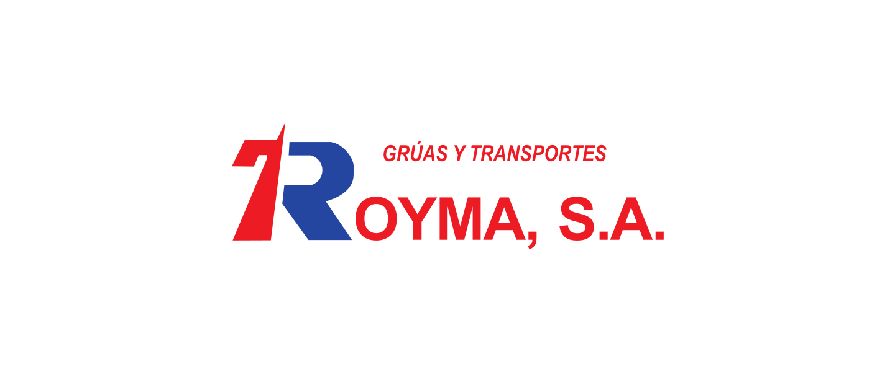

  

  

**Grúas Royma** es una empresa especializada en soluciones para el sector de la construcción, con amplia experiencia en maquinaria de elevación, transportes y servicios de ingeniería. 
  
Desde sus inicios, la empresa ha desarrollado su actividad en el ámbito de los aparatos elevadores para obras de construcción, ampliando posteriormente sus servicios con plataformas elevadoras, montacargas, plataformas de transporte, grupos electrógenos y transporte mediante camiones y tráiler grúa.

---

### 🏗️ Actividad

Nuestra actividad comprende::
- Alquiler, montaje y legalización de maquinaria de elevación
- Transporte con camiones y tráiler grúa
- Alquiler y legalización de grupos electrógenos insonorizados
- Legalizaciones de ingeniería en aparatos elevadores y baja tensión

---

### 👨‍💻 Desarrollo y tecnología

Esta organización reúne los proyectos y recursos digitales desarrollados para Grúas Royma, incluyendo su presencia web, herramientas internas y futuras soluciones digitales.

---

### 🌐 Más sobre nosotros
- Página web: [www.gruasroyma.com](https://gruasroyma.com/)
- LinkedIn: [linkedin.com/company/company/grúas-y-transportes-royma](https://www.linkedin.com/company/gr%C3%BAas-y-transportes-royma)
- Instagram: [instagram.com/royma.gyt](https://www.instagram.com/royma.gyt/)
